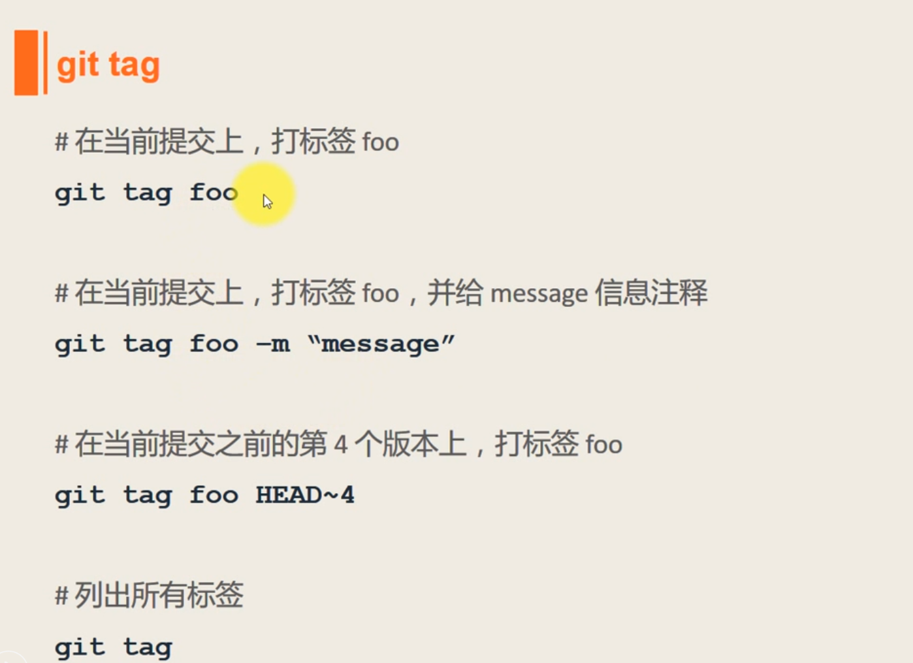
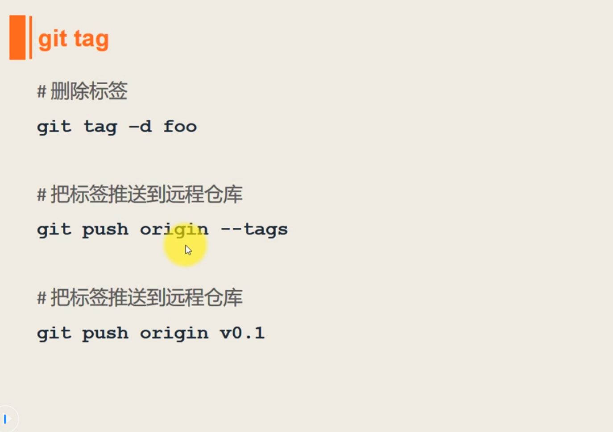

# 1 配置SSH服务
## 1.1 获取ssh密匙  
- ssh-keygen -t rsa -C "690939050@qq.com"  

## 1.2 在github添加密匙  
- id_rsa.pub

## 1.3 测试是否已经成功连上了GitHub  
- ssh -T  git@github.com

## 1.4 设置全局变量  
- git config --global user.name "hai"
- git config --global user.email "690939050@qq.com"
---
# 2 设置忽略文件
- vi ~/.gitignore  
---
# 3 常用命令：
## 3.1 基本命令
- git status
- git add  file
- git rm  file
- git rm --cache file   //删除暂存区的file
- git commit -m "..."
- git push
- git checkout -- file  //其实是用版本库里的版本替换工作区的版本，无论工作区是修改还是删除，都可以“一键还原”。
---
- git config --global core.safecrlf false  //取消windows下换行警告
- git log --pretty=format:'%h %ad | %s%d [%an]' --graph --date=short
---
## 3.1 设置命令别名：
- git config --global alias.ci  commit
- git config --global alias.hi log --pretty=format:'%h %ad | %s%d [%an]' --graph --date=short
---

## 3.2 添加远程创库的链接：
- git remote add origin  git@github.com:dhai1011/xxx
- git push -u origin master  //由于远程库是空的，我们第一次推送master分支时，加上了-u参数，Git不但会把本地的master分支内容推送的远程新的master分支，还会把本地的master分支和远程的master分支关联起来，在以后的推送或者拉取时就可以简化命令。
- git push origin master   //推送最新修改

## 3.4 查看README.md
- git blame README.md
- git blame -L 5,10 README.md   //查看第5到10行

## 3.5 删除未被跟踪的文件（未被添加到缓存区的文件）
- git clean -n    //列出要删除的文件  
- git clean -f    //删除要删除的文件  
- git clean -x -f    //设置删除 .gitignore 中忽略的文件

## 3.6 信息查看
- git status -sb  //short and branch  
- git show HEAD  //查看某个提交信息  
- git show HEAD~  //git show HEAD~1  
- git tag tt HEAD\~4   //给倒数第5次提交（到时第一次提交时HEAD,到数第二次提交时HEAD\~）设置一个标准  
- git diff tt  //查看工作区与第5次提交的差别  
- git log <file name>  
- git log --grep <msg>
- git log -n  
- git log  

## 3.7 git tag  
  
 

---
# 4 系统教程
## 4.1 创建版本库
- 初始化一个Git仓库  
  - git init
- 添加文件到Git仓库
  - git add  < file >
  - git commit -m  < message >  

## 4.2 版本回退
- 查看历史提交
  - git log
- 回退指导版本（commit_id）
  - git reset --hard commit_id
- 回退到上一个版本
  - git reset --hard HEAD^  
  Git必须知道当前版本是哪个版本，在Git中，用HEAD表示当前版本，上一个版本就是HEAD^，上上一个版本就是HEAD^^，当然往上100个版本写100个^比较容易数不过来，所以写成HEAD~100。
- 现在，你回退到了某个版本，关掉了电脑，第二天早上就后悔了，想恢复到新版本怎么办？找不到新版本的commit id怎么办？
  - git reflog  
    此命令用于查看以前新版本（当前版本是 以前新版本 回退后的版本）的commit_id。  

## 4.3 撤销修改
- 场景1：当你改乱了工作区某个文件的内容，想直接丢弃工作区的修改时，用命令 git checkout -- < file >。

- 场景2：当你不但改乱了工作区某个文件的内容，还添加到了暂存区时，想丢弃修改，分两步，第一步用命令 git reset HEAD < file >，就回到了场景1，第二步按场景1操作。

- 场景3：已经提交了不合适的修改到版本库时，想要撤销本次提交，参考版本回退一节，不过前提是没有推送到远程库。

## 4.4 添加远程库
  - 见 3.2 添加远程创库的链接

## 4.5 从远程库克隆
  - git clone git@github.com:dhai1011/note.git
<!--- 下面是本文档中的链接 -->